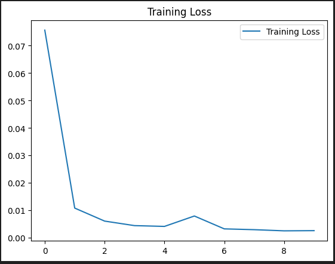

# DeepLearningFamily

Project intended to implement a solution for the Kaggle project: [Project Description](https://www.kaggle.com/competitions/recognizing-faces-in-the-wild/data)

**Description**

Do you have your father’s nose?

Blood relatives often share facial features. Now researchers at Northeastern University want to improve their algorithm for facial image classification to bridge the gap between research and other familial markers like DNA results. That will be your challenge in this new Kaggle competition.

An automatic kinship classifier has been in the works at Northeastern since 2010. Yet this technology remains largely unseen in practice for a couple of reasons:

1. Existing image databases for kinship recognition tasks aren't large enough to capture and reflect the true data distributions of the families of the world.

2. Many hidden factors affect familial facial relationships, so a more discriminant model is needed than the computer vision algorithms used most often for higher-level categorizations (e.g. facial recognition or object classification).

In this competition, you’ll help researchers build a more complex model by determining if two people are blood-related based solely on images of their faces. If you think you can get it "on the nose," this competition is for you.

# Technical
Based on the data description in the project, there will be 2 folders: *train* and *test*, and also 2 csv files: *train_relationships.csv* and *sample_submissions.csv*.

The execution of the code goes in the following order:
1. __DATA_PREPARATION.ipynb__: Takes the information from *train* folder and the *train_relationships.csv* file and creates another file with all the combinations and labels based on the information. This final file will be the entry data of the model, to facilitate the data loader process.
2. __ModelTraining.ipynb__: Will take the input data and divide in 80/20% for training and validation, and perform the training process followed by the validation. Finally will excecute the test based on the *sample_submissions.csv* file and calculate the accuracy of the model.

# Results

**Training Process**

**Charts**

 

